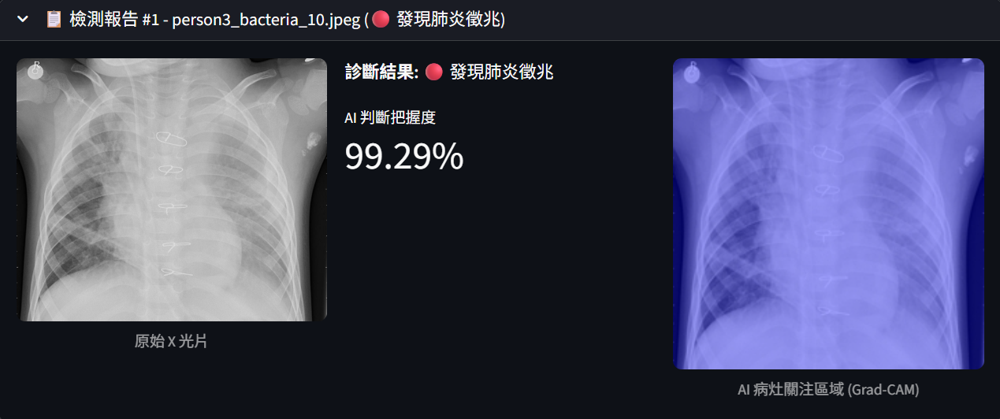

# AI Pneumonia Screening Research Prototype

[](https://www.python.org/downloads/)
[](https://pytorch.org/)
[](https://streamlit.io/)
[](LICENSE)



This repository is a research and portfolio prototype for binary pneumonia
screening from chest X-ray images. It uses a Vision Transformer (ViT) to
estimate `P(NORMAL)` and `P(PNEUMONIA)`, then applies a configurable pneumonia
probability threshold for screening decisions.

This project is not a medical device and is not intended for diagnosis. Any
clinical use would require independent validation, calibration, privacy review,
regulatory review, and clinician oversight.

## Features

- Binary ViT classifier for `NORMAL` vs `PNEUMONIA`
- Streamlit batch upload app with CSV export
- Pneumonia-probability thresholding with a manual-review band
- Pneumonia-focused Grad-CAM visualizations
- SHAP example generation
- Test-set evaluation with ROC, PR, calibration, sensitivity, specificity, PPV, NPV, and bootstrap confidence intervals
- Optional fairness analysis when real sensitive-attribute metadata is available
- Docker and GitHub Actions CI

## Quick Start

```bash
git clone https://github.com/Lin060105/Pneumonia-ViT-Project.git
cd Pneumonia-ViT-Project
python -m venv .venv
# Windows: .venv\Scripts\activate
# macOS/Linux: source .venv/bin/activate
git lfs pull
pip install -r requirements.txt -r requirements-dev.txt
```

Python 3.10 is the tested runtime. A clean virtual environment is preferred over
mixing PyTorch wheels into a broad Anaconda base environment.

Download the Kermany dataset if it is not already present:

```bash
python setup_dataset.py
```

Run the app:

```bash
streamlit run app_binary.py
```

## Clean Training Workflow

The training script does not use `chest_xray/test` for model selection. By
default it creates a grouped validation split from `chest_xray/train` so the
test folder remains untouched until final evaluation.

```bash
python train_binary.py --epochs 10 --batch-size 32 --lr 1e-4
```

The saved checkpoint includes model metadata such as architecture, class order,
normalization values, seed, validation strategy, and best validation metrics.
Legacy plain `state_dict` checkpoints are still supported by the loaders.

## Final Evaluation

Evaluate the fixed checkpoint on the held-out test set:

```bash
python evaluate_binary.py \
  --model-path saved_models/pneumonia_binary_best.pth \
  --test-dir chest_xray/test \
  --threshold 0.5 \
  --output-dir results
```

To select a threshold before testing, provide a separate validation folder:

```bash
python evaluate_binary.py \
  --threshold-from-dir chest_xray/val \
  --target-sensitivity 0.95 \
  --test-dir chest_xray/test \
  --output-dir results
```

Do not tune thresholds on the test set.

## Single Image Prediction

```bash
python predict.py chest_xray/test/PNEUMONIA/person10_virus_35.jpeg --threshold 0.5
```

## Explainability

Generate a Grad-CAM heatmap for pneumonia evidence:

```bash
python explain_vit.py chest_xray/test/PNEUMONIA/person10_virus_35.jpeg
```

Generate a small SHAP example:

```bash
python explain_shap.py --data-dir chest_xray/test --output shap_explanation.png
```

## Fairness Analysis

Fairness analysis requires real metadata. The script will not create synthetic
demographic groups.

```bash
python bias_analysis.py \
  --metadata-csv metadata.csv \
  --image-column filename \
  --group-column age_group \
  --output results/bias_analysis_report.csv
```

## Docker

```bash
docker build -t pneumonia-vit-app .
docker run -p 8501:8501 pneumonia-vit-app
```

Open `http://localhost:8501`.

## Project Structure

| Path | Purpose |
|---|---|
| `app_binary.py` | Streamlit screening UI |
| `model_utils.py` | Shared model, checkpoint, preprocessing, and threshold helpers |
| `train_binary.py` | Binary ViT training with clean validation split |
| `evaluate_binary.py` | Test-set evaluation and clinical metrics |
| `predict.py` | Single-image CLI prediction |
| `explain_vit.py` | Pneumonia-focused Grad-CAM |
| `explain_shap.py` | SHAP example generation |
| `bias_analysis.py` | Fairness analysis with real metadata |
| `setup_dataset.py` | Dataset download and safe extraction |
| `tests/` | Unit tests |

## Notes

The repository includes generated example figures and LFS-managed model
weights. Regenerate all reports after retraining with the clean split workflow
before presenting final performance numbers.
