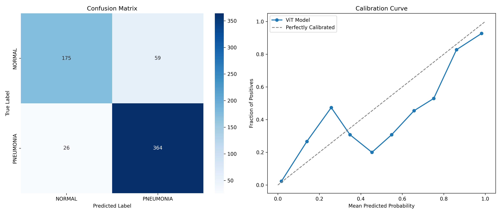
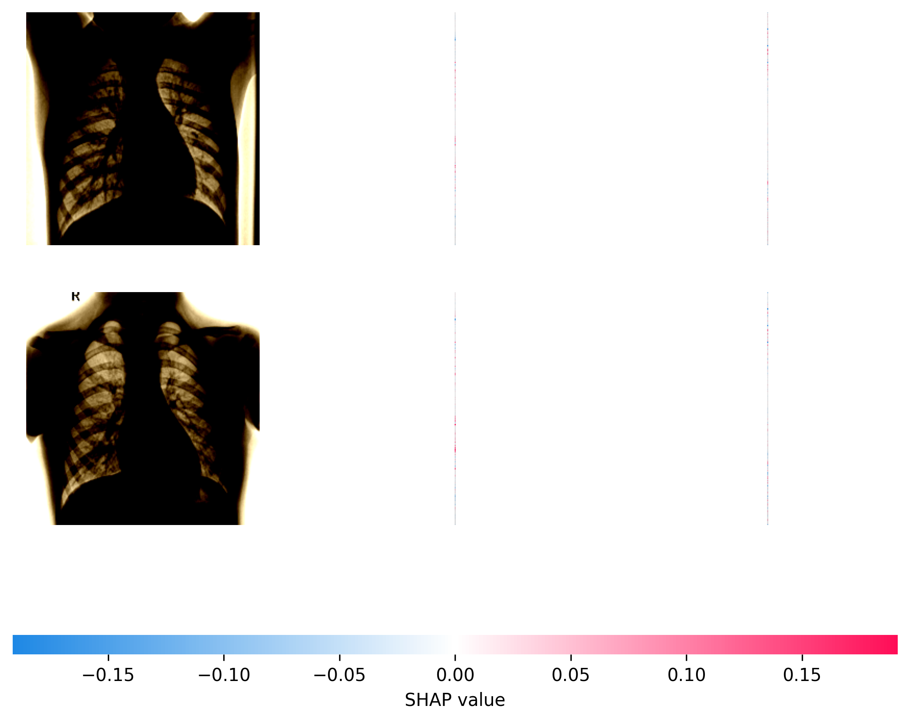

# 🏥 AI Pneumonia Screening System (ViT) / 智慧肺炎影像篩檢系統

[](https://www.python.org/downloads/)
[](https://pytorch.org/)
[](https://streamlit.io/)
[](https://opensource.org/licenses/MIT)


[English](#english) | [繁體中文](#繁體中文)

---

## English

### 📌 Project Overview

This project is an AI-powered medical image screening system designed to detect pneumonia from chest X-ray images. Utilizing a **Vision Transformer (ViT)** architecture, the model focuses on a high-precision binary classification task (Normal vs. Pneumonia) to provide reliable clinical alerts.

To enhance clinical interpretability, the system integrates **Grad-CAM (Gradient-weighted Class Activation Mapping)** to visualize the specific lung regions the AI focused on when making its prediction.

### ✨ Key Features

- **Binary Clinical Screening:** Refactored from a multi-class approach to a highly robust binary classification (Normal vs. Pneumonia), achieving **86.38% validation accuracy** on the Kermany dataset.
- **Batch Processing & Excel Export:** Designed for real-world hospital workflows, allowing users to upload dozens of X-rays at once and export a comprehensive diagnostic report in CSV/Excel format.
- **Explainable AI (XAI):** Automatically generates heatmaps (Grad-CAM) to highlight potential inflammation areas, assisting medical professionals in diagnosis.
- **Interactive UI:** A clean, user-friendly Web App built with Streamlit, featuring an adjustable AI confidence threshold and dual-mode execution (Detailed vs. Fast Batch).

### 🚀 Getting Started

**1. Clone the repository:**

```bash
git clone https://github.com/Lin060105/Pneumonia-ViT-Project.git
cd Pneumonia-ViT-Project
```

**2. Pull the model weights (Requires Git LFS):**

```bash
git lfs pull
```

**3. Install dependencies:**

```bash
pip install -r requirements.txt
```

**4. Auto-download & setup the dataset:**

```bash
python setup_dataset.py
```

**5. Run the application:**

```bash
streamlit run app_binary.py
```

### 🐳 Docker 快速部署 (一鍵啟動)

本專案支援容器化部署，確保在任何環境下皆可穩定執行：

**1. 建置 Docker 映像檔 (Image)：**

```bash
docker build -t pneumonia-vit-app .
```

**2. 啟動容器 (Container)：**

```bash
docker run -p 8501:8501 pneumonia-vit-app
```

**3.** 打開瀏覽器並前往 `http://localhost:8501` 即可開始使用。

---

## 繁體中文

### 📌 專案簡介

本專案為一套基於人工智慧的醫療影像輔助篩檢系統，專門用於分析胸部 X 光片以檢測肺炎徵兆。系統採用先進的 **Vision Transformer (ViT)** 模型架構，透過二元分類（正常 vs. 肺炎）提供高可靠度的臨床警示。

為了解決醫療 AI 的「黑盒子」問題，本系統整合了 **Grad-CAM 可解釋性 AI** 技術，能夠自動生成熱力圖，視覺化標示出 AI 判斷時所關注的疑似病灶區域。

### ✨ 核心亮點

- **高準確度二元篩檢：** 針對臨床需求進行架構重構，專注於區分「正常」與「肺炎」，在 Kermany 資料集上達到 **86.38%** 的驗證準確率。
- **批次檢測與 Excel 報表匯出：** 專為真實醫院工作流設計，支援一次框選上傳大量 X 光片進行極速運算，並可一鍵下載包含 AI 診斷結果與信心度的 Excel (CSV) 總表。
- **可解釋性 AI (XAI)：** 透過熱力圖疊加技術，輔助醫師快速定位肺部異常浸潤或發炎區域。
- **雙模式互動介面：** 使用 Streamlit 打造，提供「詳細報告模式」與「快速批次模式」，並支援自訂 AI 信心度門檻。

### 📊 臨床效能與可解釋性 (Clinical Performance & XAI)

本專案不僅追求高準確率，更導入了業界標準的 MLOps 與醫療 AI 評估指標，確保模型具備高度的臨床可靠性與可解釋性。

**1. 醫療核心指標與校準 (Clinical Metrics & Calibration)**

左圖為混淆矩陣，展現極低的漏診率 (False Negative)；右圖為校準曲線 (Calibration Curve)，證明 AI 輸出的機率值具備高度可信度。



**2. SHAP 進階特徵歸因 (SHAP Explainability)**

除了常規的 Grad-CAM，本專案額外導入 SHAP (SHapley Additive exPlanations) 黑盒遮罩法，精細解析像素級別的特徵貢獻，徹底打破 AI 黑盒子。



### 📁 專案架構 (Project Structure)

| 檔案 / 資料夾 | 說明 |
|---|---|
| `app_binary.py` | Streamlit 網頁應用程式主程式（含批次與匯出功能） |
| `train_binary.py` | ViT 模型二分類訓練與資料增強腳本 |
| `saved_models/` | 存放訓練完成的 ViT 權重檔 (`.pth`) |
| `requirements.txt` | 專案環境與雲端部署依賴套件清單 |